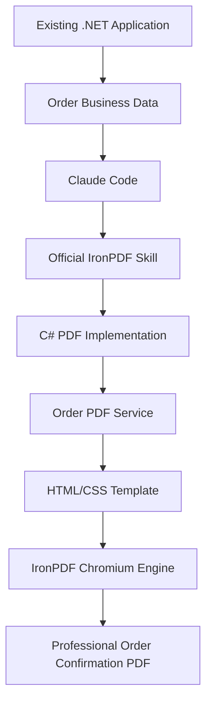

# How Can a .NET Developer Use Claude Skills to Implement a Production-Ready PDF Workflow with IronPDF?

[](https://dotnet.microsoft.com/)
[](https://ironpdf.com/)
[](LICENSE)

## Overview

This repository demonstrates how a .NET developer can use **Claude Code + Claude Skills + IronPDF** to implement a production-ready, multi-page **Order Confirmation PDF** workflow inside an enterprise ASP.NET Core business application.

---

## What This Project Demonstrates



### The Central Distinction: Development-Time vs Runtime

```text
DEVELOPMENT TIME
────────────────
Developer  ──►  Claude Code  ──►  IronPDF Skill  ──►  C# & CSS Implementation  ──►  Developer Review

RUNTIME
───────
Order Data ──►  OrderPdfService  ──►  HTML/CSS  ──►  IronPDF  ──►  Order Confirmation PDF
```

* **Claude Code** acts as the **development-time AI coding assistant** that plans architecture, references official skills, writes C# services, and crafts print-ready CSS templates.
* **Claude Skills** (`.claude/skills/ironpdf/SKILL.md`) equip Claude with official, verified IronPDF knowledge and API best practices.
* **IronPDF** executes at **runtime** inside the .NET application to render vector-accurate, multi-page PDFs using its embedded Chromium engine.

---

## The Business Problem

Businesses need to convert rich transactional order data (customers, shipping/billing addresses, multi-item pricing, discounts, tax rates, shipping fees) into pixel-accurate, downloadable **Order Confirmation PDFs**.

This solution delivers:
1. **Company Branding**: Logo placeholder, header typography, contact details, and tax ID.
2. **2-Column Layout**: Structured Bill-To / Ship-To customer addresses and order metadata.
3. **Comprehensive Data Table**: SKU, product name, description, quantity, unit price, item discount, tax, and line total.
4. **Financial Summary**: Subtotal, itemized discounts, taxes, shipping, and bold grand total.
5. **Multi-Page Support**: Automatic page breaks, repeating table headers across pages (`thead`), and footer page counters (`Page {page} of {total-pages}`).

---

## Architecture

The project follows clean architecture principles with decoupled layers:

```text
ClaudeIronPdfDemo/
│
├── src/
│   ├── OrderPdf.Domain/                 # Core entities (Order, OrderItem, Customer, Company)
│   ├── OrderPdf.Application/            # Interfaces, ViewModels & TemplateRenderer
│   ├── OrderPdf.Infrastructure/         # IronPdf OrderPdfService & InMemoryOrderRepository
│   └── OrderPdf.Api/                    # ASP.NET Core Web API Controllers & OpenAPI
│
├── samples/                             # JSON test datasets
│   ├── simple-order.json                # Sample 1: Standard 1-page order
│   ├── discounted-order.json            # Sample 2: Complex discount/tax order
│   └── large-order.json                 # Sample 3: 50+ item multi-page order
│
├── .claude/
│   └── skills/
│       └── ironpdf/
│           ├── SKILL.md                 # Official IronPDF Skill (vendored verbatim)
│           ├── llms.txt                 # Official IronPDF LLMs Index (vendored verbatim)
│           └── SOURCE.md                # Provenance: source, fetch date, refresh steps
│
├── docs/                                # Detailed technical guides
│   ├── architecture.md
│   ├── claude-workflow.md
│   ├── pdf-workflow.md
│   └── deployment.md
│
├── output/                              # Generated PDF artifacts
│   ├── sample-order-confirmation.pdf
│   ├── sample-discounted-order.pdf
│   └── sample-large-order.pdf
│
├── tests/
│   └── OrderPdf.Tests/                  # Unit & integration tests
│
├── CLAUDE.md                            # Project memory for Claude Code
├── CONTRIBUTING.md
├── README.md
└── LICENSE
```

---

## Technology Stack

- **Framework**: .NET 10 (`net10.0`)
- **Language**: C# 13/14 (Nullable Reference Types, File-scoped Namespaces, Record structs)
- **PDF Engine**: IronPDF (`IronPdf` NuGet package)
- **Web API**: ASP.NET Core Web API with Controllers & OpenAPI (`/openapi/v1.json`)
- **Testing**: xUnit, FluentAssertions

---

## Claude Skills & IronPDF Resources

The repository includes the official Iron Software skill and LLM index:

- **Official Skill**: [`.claude/skills/ironpdf/SKILL.md`](.claude/skills/ironpdf/SKILL.md) (Source: [https://ironpdf.com/skill.md](https://ironpdf.com/skill.md))
- **LLM Index**: [`.claude/skills/ironpdf/llms.txt`](.claude/skills/ironpdf/llms.txt) (Source: [https://ironpdf.com/llms.txt](https://ironpdf.com/llms.txt))

---

## Running the Application

### 1. Clone and Build
```bash
git clone <repository-url>
cd claude-ironpdf-dotnet
dotnet restore
dotnet build
```

### 2. Configure IronPDF License
Set the license key via environment variable:
```bash
# Windows PowerShell
$env:IRONPDF_LICENSE_KEY="YOUR_KEY_HERE"

# Linux / macOS
export IRONPDF_LICENSE_KEY="YOUR_KEY_HERE"
```
*(Without a key, IronPDF runs in trial mode: pages carry a trial watermark, and once the trial grace period expires `SaveAs` throws `Production use: Requires a license`. Rendering can succeed and saving still fail. The app logs its license state at startup.)*

### 3. Run the Web API
```bash
dotnet run --project src/OrderPdf.Api
```

Open the demo page in your browser:
```text
https://localhost:7000/
```

---

## Generating an Order PDF

### Via API Endpoint
```http
GET /api/orders/{orderId}/pdf
```

Example request:
```bash
curl -O -J https://localhost:7000/api/orders/ord-simple-001/pdf
```

### Response
- **Content-Type**: `application/pdf`
- **Content-Disposition**: `attachment; filename="Order-ORD-2026-00125.pdf"`

---

## Sample Orders

| Scenario | Order Number | Description | Expected Length |
| :--- | :--- | :--- | :--- |
| **Sample 1: Simple Order** | `ORD-2026-00125` | 3 line items, standard tax & shipping | ~1 Page |
| **Sample 2: Discounted Order** | `ORD-2026-00126` | 4 line items, high discounts, MSA terms | ~1–2 Pages |
| **Sample 3: Large Order** | `ORD-2026-00127` | 65 line items, bulk rollout, repeated headers | 3+ Pages |

---

## Multi-Page PDF Features

1. **Repeating Table Headers**: `thead { display: table-header-group; }` ensures the item columns remain visible on every page.
2. **Page-Break Control**: `tr { page-break-inside: avoid; }` prevents individual product lines from splitting across pages.
3. **Dynamic Pagination**: Footers render `{page}` of `{total-pages}`.

---

## Production Considerations

- **Security & XSS Prevention**: All text fields interpolated into the HTML template are sanitized using `WebUtility.HtmlEncode()`.
- **Resource Management**: `PdfDocument` is wrapped in `using` blocks to prevent unmanaged memory leaks.
- **Asynchronous Execution**: Uses non-blocking `RenderHtmlAsPdfAsync()`, with the request's `CancellationToken` observed before rendering begins.
- **Financial Precision**: All currency values use `decimal` precision to prevent floating-point rounding errors.
- **Deployment**: platform packages, Docker, fonts and hosting notes are in [docs/deployment.md](docs/deployment.md). The default `IronPdf` package reference is Windows-only.
- **Renderer Lifecycle**: a `ChromePdfRenderer` is constructed per request by design — its `RenderingOptions` carry per-order header and footer values, so a shared instance would race across concurrent requests.
- **Startup Warm-Up**: `IronPdf.Installation.Initialize()` runs at boot so the first user request does not pay Chromium's initialisation cost.

---

## Testing

Run all unit and integration tests:

```bash
dotnet test
```

Tests verify:
- Domain mathematical accuracy (`Subtotal`, `Discount`, `Tax`, `GrandTotal`).
- HTML encoding and template rendering integrity.
- IronPDF generating valid `%PDF-` byte output for both single and 50+ item multi-page orders.
- Controller HTTP responses (200 OK, 404 Not Found, 400 Bad Request).

---

## Contributors

Created and maintained by **Kanaiya Katarmal**.

IronPDF and the official IronPDF Skill vendored in `.claude/skills/ironpdf/` are
published by **Iron Software**, who also reviewed this project's IronPDF API usage,
licensing and deployment guidance.

This is a community project built with IronPDF, not an official Iron Software sample.

See [CONTRIBUTORS.md](CONTRIBUTORS.md) for contributor details.

---

## License

This project is licensed under the [MIT License](LICENSE).
