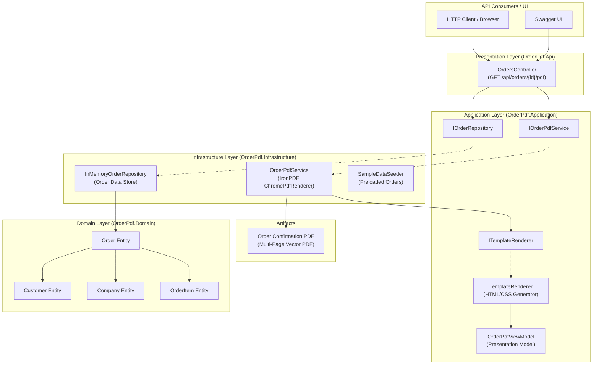

# Architecture & System Design

This document details the software architecture, design principles, and separation of concerns implemented in the **Claude IronPDF .NET Order Confirmation Workflow**.

---

## 1. High-Level Architecture Diagram



---

## 2. Layer Responsibilities

### 2.1 Domain Layer (`OrderPdf.Domain`)
- Contains pure business entities: `Order`, `OrderItem`, `Customer`, `Company`, `Address`, and `Product`.
- Encapsulates financial calculations using high-precision `decimal` arithmetic (`Subtotal`, `DiscountAmount`, `TaxAmount`, `Shipping`, `GrandTotal`).
- Has zero dependencies on any external framework, ORM, or PDF library.

### 2.2 Application Layer (`OrderPdf.Application`)
- Defines interfaces: `IOrderPdfService`, `IOrderRepository`, `ITemplateRenderer`.
- Transforms domain models into sanitized, presentation-ready ViewModels (`OrderPdfViewModel`, `OrderItemViewModel`).
- Provides HTML/CSS template generation with automatic HTML character encoding (`WebUtility.HtmlEncode`) to prevent XSS / injection attacks.

### 2.3 Infrastructure Layer (`OrderPdf.Infrastructure`)
- References the `IronPdf` NuGet package.
- Implements `OrderPdfService` using `ChromePdfRenderer` with print media styles, custom margins, dynamic header/footer page numbers (`{page}` of `{total-pages}`), and repeated table headers.
- Implements `InMemoryOrderRepository` seeded with sample orders (1-page, discounted, and 50+ item multi-page order).

### 2.4 Presentation API Layer (`OrderPdf.Api`)
- Exposes RESTful endpoints (`OrdersController`).
- Handles HTTP requests, content negotiation, Swagger documentation, and streams PDF binary data as `application/pdf` with `Content-Disposition: attachment`.
- Manages startup lifecycle, Dependency Injection, and IronPDF license initialization.

---

## 3. Dependency Injection Setup

All dependencies are registered in `Program.cs` via ASP.NET Core DI:

```csharp
// Repositories & Engine Services
builder.Services.AddSingleton<IOrderRepository, InMemoryOrderRepository>();
builder.Services.AddScoped<ITemplateRenderer, TemplateRenderer>();
builder.Services.AddScoped<IOrderPdfService, OrderPdfService>();
```

---

## 4. Key Architectural Decisions

1. **Decoupled PDF Engine**:
   `OrdersController` only depends on `IOrderPdfService`. If the rendering engine or template engine ever changes, zero controller code is modified.

2. **Isolated Presentation Mapping**:
   The HTML template never directly accesses domain entities or raw database entities. It interacts strictly with `OrderPdfViewModel`.

3. **Chromium-Powered Pixel Precision**:
   IronPDF uses an embedded Chromium engine to guarantee that CSS Flexbox, CSS Grid, media print rules, typography, and page breaks render with exact pixel fidelity.
