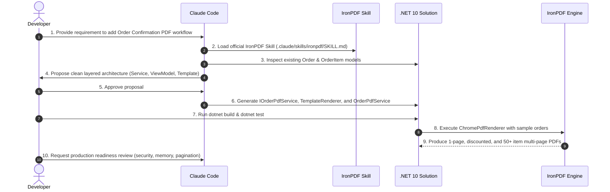

# Claude Code & Claude Skills Development Workflow

This document illustrates how a .NET developer leverages **Claude Code** paired with the **Official IronPDF Skill** to build, refine, and verify a production-ready PDF workflow.

---

## 1. Development-Time vs Runtime Distinction

A crucial principle of this architecture is the clean distinction between development-time AI assistance and runtime application execution:

```text
DEVELOPMENT TIME
────────────────

Developer
    │
    ▼
Claude Code (AI Assistant)
    │
    ▼
Official IronPDF Skill (.claude/skills/ironpdf/SKILL.md)
    │
    ▼
C# PDF Implementation & HTML/CSS Template
    │
    ▼
Developer Code Review & Automated Tests


RUNTIME
───────

Order Business Data
    │
    ▼
OrderPdfService
    │
    ▼
HTML/CSS Template
    │
    ▼
IronPDF (Chrome Rendering Engine)
    │
    ▼
Professional Order Confirmation PDF
```

> **Key Rule**: Claude Code and Claude Skills assist the developer *during development* to write clean, type-safe C# and print-optimized CSS. At runtime, the application runs purely on .NET 10 and the IronPDF Chromium rendering engine.

---

## 2. Development Walkthrough



### Step 1: Discover & Inspect Existing Code
The developer points Claude Code to the repository. Claude inspects the existing domain entities (`Order`, `OrderItem`, `Customer`, `Company`, `Address`).

### Step 2: Load the Official IronPDF Skill
Claude Code automatically discovers `.claude/skills/ironpdf/SKILL.md`, reading official guidance for .NET 10, package naming, Chromium initialization, and header/footer configurations.

### Step 3: Architectural Proposal
Claude proposes an isolated service architecture (`IOrderPdfService`, `TemplateRenderer`, `OrderPdfViewModel`) so business logic and controllers remain completely uncoupled from PDF rendering logic.

### Step 4: Template Engineering
Claude creates the HTML/CSS template using semantic HTML5, CSS Flexbox/Grid, and `@media print` rules:
- `thead { display: table-header-group; }` (for repeating table headers)
- `tr { page-break-inside: avoid; }` (preventing awkward row splits)
- `WebUtility.HtmlEncode()` (for injection protection)

### Step 5: IronPDF Engine Integration
Claude writes `OrderPdfService` using `ChromePdfRenderer`, setting custom print margins, portrait A4 paper size, and `HtmlHeaderFooter` with dynamic `{page}` of `{total-pages}` tokens.

### Step 6: Testing with Real Business Scenarios
The developer runs automated tests with three realistic sample orders:
1. **Simple Order** (1-page standard order)
2. **Discounted Order** (1-2 pages with line item discounts, taxes, and shipping)
3. **Large Order** (3+ pages, 65 line items testing automatic page breaks and repeated table headers)

### Step 7: Multi-Page & Pagination Polish
The developer and Claude verify that:
- Table headers repeat cleanly across subsequent pages.
- No page has orphaned summary rows or truncated content.
- Page numbers increment correctly (`Page 1 of 3`, `Page 2 of 3`, `Page 3 of 3`).

### Step 8: Production Readiness Review
Claude reviews the implementation against production best practices:
- Asynchronous non-blocking calls (`RenderHtmlAsPdfAsync`)
- `CancellationToken` propagation
- Explicit resource disposal via `using var pdf`
- Zero hardcoded secrets / secure environment licensing (`IRONPDF_LICENSE_KEY`)

### Step 9: Where the Skill Corrected Claude

The useful part of a skill is not that it supplies API names. It is that it stops a
plausible wrong answer before it reaches the codebase. One case from this build:

**What Claude reached for first**

```csharp
// Shared renderer, constructed once and reused for every request.
builder.Services.AddSingleton<ChromePdfRenderer>();
```

**What the skill said**

> Performance: reuse one `ChromePdfRenderer` instance, prefer the async render
> methods in servers, call `Installation.Initialize()` at boot […]

Read alone, that endorses the singleton.

**Why it was still wrong here**

`RenderingOptions` is mutable instance state, and this service writes the company
name and order number into the page header. Two concurrent requests sharing one
renderer race on those properties, and the symptom is not an exception — it is one
customer's order number printed on another customer's PDF.

**What shipped**

A renderer per request, with a comment at the call site recording why, so the next
reader does not "optimise" it into the race. The genuine one-time cost —
Chromium initialisation — is paid once at boot by `Installation.Initialize()`, which
is where the skill's performance advice actually applies. If throughput ever demands
renderer reuse, the answer is a pool with exclusive rental, not a shared instance.

**The transferable lesson**

A skill encodes what is true of the library. It cannot know what is true of your
call site. Claude applying skill guidance correctly and still producing a bug is the
normal case, not the surprising one, and it is the reason the review in Step 8 exists.
